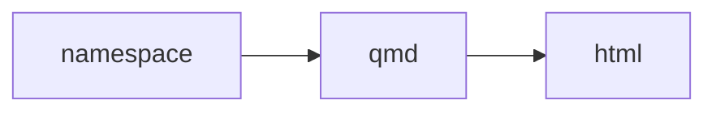

# The Clojure Data Scrapbook project [DRAFT]


Community-contributed examples for the emerging Clojure data stack.

This project builds [The Clojure Data Scrapbook](https://scicloj.github.io/clojure-data-scrapbook/).

You can interact with the examples by cloning this project and starting a REPL.

## Status

Work in progress.
Change are likely after more thought and sharing.

## Using this book

You can read the book online [The Clojure Data Scrapbook](https://scicloj.github.io/clojure-data-scrapbook/).

### Starting a REPL

To run this project you will need to first [Install Clojure](https://clojure.org/guides/install_clojure).

To run code examples, clone this repo and start a REPL.

### Editor Setup

This project uses Clay for interactive examples.
Please see the [Clay Setup Guide](https://scicloj.github.io/clay/#setup)

* Right click main/deps.edn and run REPL
* Set my Java SDK is a pre-requisite

## Project overview

[./projects/](./projects) contains code

[./projects/main/notebooks](./projects/main/notebooks) contains most of the miscellaneous examples

[./book/](./book) contains Markdown configuration and `prepare` script

[./docs](./docs) is the published part

### Render and watch locally

`./book/prepare.sh` will watch for changes

This starts a process that will convert Clojure namespaces into Quarto Markdown files and then compile them to HTML views.



Ordering of parts

## Troubleshooting

If you encounter the following:
Error building classpath. Could not acquire write lock for 'artifact:org.bytedeco:mkl'

```
clj -P -Sthreads 1
```
[Reported here](https://clojurians-log.clojureverse.org/tools-deps/2021-09-16)

## Contributing

Please see [CONTRIBUTING.md](./CONTRIBUTING.md)

## Rationale and Design

Please see [DESIGN.md](./DESIGN.md).

## License

Copyright © 2022 Scicloj

Distributed under the Eclipse Public License version 1.0.
