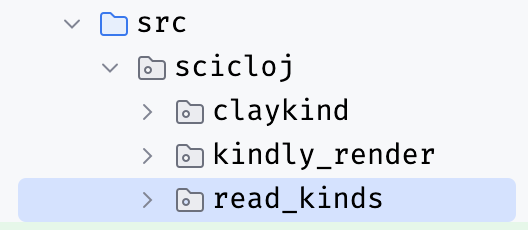

## Graphs

::: {layout-ncol=2}


:::

::: {style="display: flex; align-items: center; justify-content: center"}

https://Hummi.app


:::

## Books 

::: {.fragment}
You can learn anything
:::

::: {.fragment}
Libraries rule
:::

::: {.fragment}
SciCloj: Clojure Data Cookbook
:::

::: {.notes}
In June 2023 I joined a SciCloj visual tools meetup.
Kira and Daniel gave some updates on the Clojure Data Cookbook and Scrapbook.
They requested some early feedback.
I made some suggestions, and we had a followup session to discuss the books further.
Beside the content, there was a troubling question of how to set up the project.
:::

## How to code a book? 

::: {.fragment}
::: {.callout-tip appearance="simple"}
keeping the code in sync with prose
:::
:::

::: {.fragment}
literate coding

chapters are namespaces

```clojure
(ns cookbook.chapter1)

;; Welcome to the Clojure Data Cookbook

(defn example1 [] ...)
```

:::

::: {.fragment}
prose, code, and visualizations
:::

::: {.fragment}
explorable, reproducible, testable
:::

## Obstacles 

::: {.fragment}
collating chapters
:::

::: {.fragment}
tool specific code
:::

::: {.fragment}
poor performance
:::

::: {.fragment}
git churn
:::

::: {.fragment}
::: {.callout-warning appearance="simple"}
lots of tools, no complete path
:::
:::

## Quarto 

::: {.fragment}
markdown books, slides, and websites
:::

::: {.fragment}
based on Pandoc
:::

::: {.fragment}
R and Python
:::

::: {.fragment}
::: {.callout-tip appearance="simple"}
focus on creating markdown suitable for Quarto
:::
:::

## Claykind 

::: {.fragment}
::: {.callout-tip appearance="simple"}
reimagine `clay` as modular parts in a `kindly` pipeline

a simpler thing might be more useful
:::
:::

## Claykind experiments 

::: {.fragment} 
eval as data
:::

::: {.fragment}
Babashka
:::

::: {.fragment}
github flavored markdown (documentation)
:::

## Eval as data



```clojure
[{:code  "(+ 1 2)"
  :form  (+ 1 2)
  :value 3
  :kind  nil}
 ...]
```

## {background-image="babashka-book.png" background-size="contain"}

## {background-image="babashka-markdown.png" background-size="contain"}

## Kindly 

::: {.fragment }
::: {.callout-tip appearance="simple"}
a standard for requesting visualizations.
:::
:::

::: {.fragment}
requests are annotations

```clojure
^:kind/hiccup [:svg [:circle {:r 50}]]
```

:::

::: {.fragment}
with a functional api

```clojure
(kind/hiccup [:svg [:circle {:r 50}]])
```

:::

::: {.fragment}
supported by tools (`clay`),

or adapted to tools (`kind-portal`, `kind-clerk`)
:::

## Kindly promise 

just works with whatever tools you want to use 

no breaking changes

non-intrusive

easy for toolmakers to support

## Kindly Discoveries

::: {.fragment}
`kindly` no behavior, only annotations
:::

::: {.fragment}
`kindly-advice` for tool-makers

multiple ways to annotate, nested annotations, kind inference (images, datasets, user extensible)

notebook projects should pin a **tool** version
:::

::: {.fragment}
`read-kinds` eval as data (unreleased)

enable other tools, Babashka notebooks, testing

(see also `note-to-test`)
:::

## Clay v2 

::: {.fragment}
lightweight (may include JavaScript)
:::

::: {.fragment}
images and data as files
:::

::: {.fragment}
**loads fast**
:::

::: {.fragment}
separation of source from target
:::

::: {.fragment}
render a project, file, or form
:::

::: {.fragment}
serve the file (or not)
:::

::: {.fragment}
::: {.callout-note appearance="simple"}
**books**, slides, and websites!
:::
:::

::: {.notes}

* way faster!
* no ClojureScript
* no embedded images/data
* less git churn

:::

## Configuration 

options file: `clay.edn`

```clojure
{:format      [:html]
 :source-path "notebooks/index.clj"}
```

to render files

```clojure
(clay/make! options)
```

extra options are merged

::: {.fragment }
::: {.callout-tip appearance="simple"}
bind a key to

```clojure
(make! {:source-path ~current-file
        :format      [:html]})
```

to view progress
:::
:::

## Write, don't show  

```clojure
{:show false}
```

## Multiple namespaces 

```clojure
{:source-path ["notebooks/slides.clj"
               "notebooks/index.clj"]}
```

## Single form 

```clojure
{:source-path "notebooks/index.clj"
 :single-form '(kind/cytoscape
                 [{:style {:width  "300px"
                           :height "300px"}}
                  cytoscape-example])}
```

::: {.fragment }
::: {.callout-tip appearance="simple"}
bind a key to

```clojure
(make! {:source-path ~current-file
        :single-form ~form-before-caret
        :show        true})
```

for interactive development
:::
:::

## Use Quarto 

```clojure
{:format [:quarto :html]}
```

## Only Markdown 

```clojure
{:format     [:quarto :html]
 :run-quarto false}
```

## Slides 

```clojure
{:format      [:quarto :revealjs]
 :source-path "notebooks/slides.clj"}
```

## Books 

```clojure
{:format           [:quarto :html]
 :base-source-path "notebooks"
 :source-path      ["index.clj"
                    "chapter.clj"
                    "another_chapter.md"]
 :base-target-path "book"
 :show             false
 :run-quarto       false
 :book             {:title "Book Example"}}
```

::: {.fragment }
::: {.callout-tip appearance="simple"}
so flexible

everything is decoupled

adaptable to your workflow

```sh
clojure -M:dev -m scicloj.clay.main
```

:::
:::

## How to literate 

::: {.fragment}
start a namespace
:::

::: {.fragment}
explore some question, idea, data
:::

::: {.fragment}
interleave prose, code, tables, images, charts
:::

::: {.fragment}
visualize from your editor
:::

::: {.fragment}
publish it
:::

::: {.fragment}
read as document or explore code
:::

::: {.fragment }
::: {.callout-tip appearance="simple"}
please try `kindly`, `clay`, `kind-portal`, `kind-clerk`
:::
:::

::: {.fragment }
::: {.callout-tip appearance="simple"}
tool-makers, please try `kind-advice`, `read-kinds`, `kindly-render`
:::
:::

## What I learnt

## About Data {background-image="TMD.svg" background-size="contain"}

::: {.fragment}
We all have questions
:::

::: {.fragment}
We observe
:::

::: {.fragment}
We write
:::

::: {.fragment }
::: {.callout-tip appearance="simple"}
Everyone is a data scientist
:::
:::

## About Writing {background-image="Cookbook.svg" background-size="contain"}

::: {.fragment}
crystallizes thinking
:::

::: {.fragment}
creates knowledge
:::

::: {.fragment}
in code
:::

::: {.fragment }
::: {.callout-tip appearance="simple"}
notebooks are namespaces
:::
:::

## Critical Thinking {background-image="scicloj.ml.svg" background-size="contain"}

::: {.fragment}
is a creative process
:::

::: {.fragment}
what else is possible?
:::

::: {.fragment }
::: {.callout-tip appearance="simple"}
it is not enough to be critical, you have to create
:::
:::

## Standardization {background-image="Kindly.svg" background-size="contain"}

::: {.fragment}
enables adaption
:::

::: {.fragment}
notebooks, blogs, books, library code, application code
:::

::: {.fragment}
keybindings, workflows
:::

::: {.fragment }
::: {.callout-tip appearance="simple"}
interactive development and static publishing
:::
:::

::: {.notes}
Kindly

Namespaces as notebooks

Interleaving prose, tables, charts and diagrams, in code

Notebooks
Blogs
Books
Library code
Application code
:::

## About Composition {background-image="Clay.svg" background-size="contain"}

::: {.fragment}
enables interactivity
:::

::: {.fragment}
enables publishing
:::

::: {.fragment}
enables reproducibility
:::

::: {.fragment }
::: {.callout-tip appearance="simple"}
lightweight, adaptable tools
:::
:::

::: {.notes}
Clay
Interactively developing
Publishing
:::

## About Simplicity {background-image="Metamorph.svg" background-size="contain"}

::: {.fragment}
begets universality
:::

::: {.fragment }
::: {.callout-tip appearance="simple"}
we make our own workflows out of libraries and tools
:::
:::

::: {.notes}
Universality is being true in all situations
:::

## About Connecting {background-image="clj-djl.svg" background-size="contain"}

::: {.fragment}
provides purpose
:::

::: {.fragment}
provides fulfillment
:::

::: {.fragment}
builds community
:::

## Communities {background-image="all.svg" background-size="contain"}

::: {.fragment}
learn together
:::

::: {.fragment}
solve problems together
:::

::: {.fragment}
::: {.callout-tip appearance="simple"}
SciCloj was born of a simple vision:
Small groups working on problems together.
Coordinating, collaborating, solving, and writing.
:::
:::

::: {.fragment}
::: {.callout-note appearance="simple"}
We'd love you to join us in search of answers.

https://scicloj.github.io/

Consider joining a study group, working group, or suggest a new group.

Your community needs you!
:::
:::

## EOF {background-image="all.svg" background-size="contain"}
