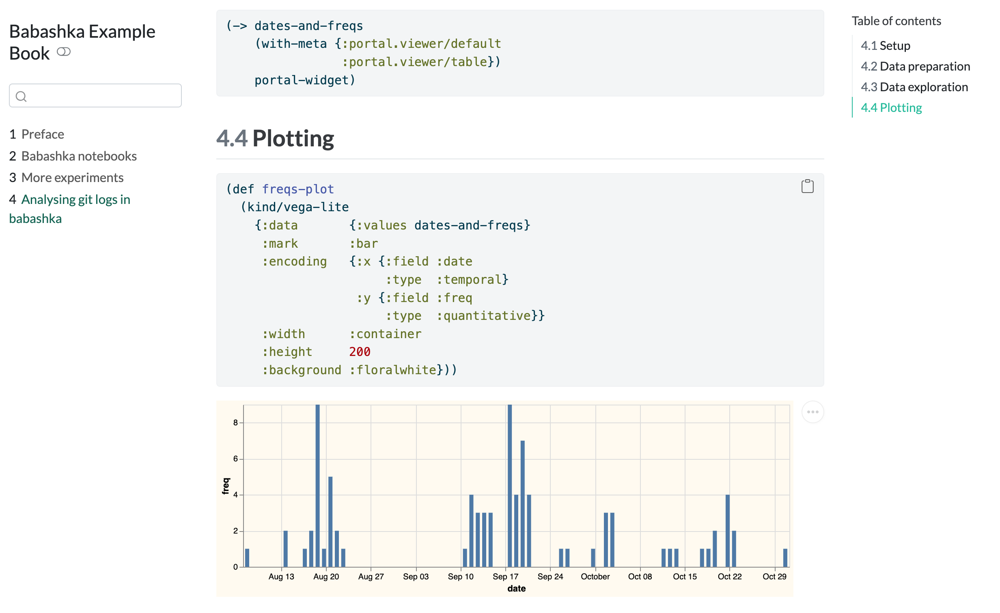
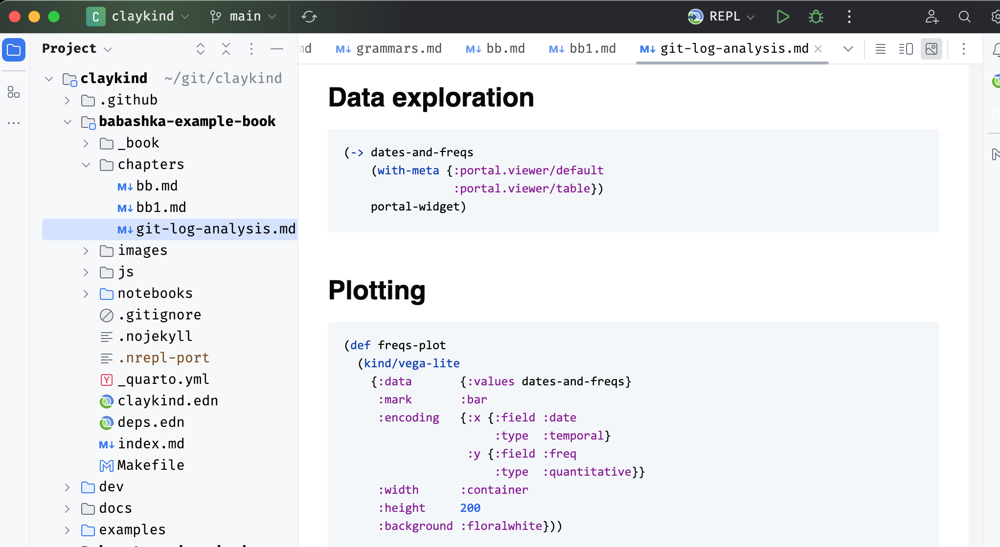

##


## Graphs

::: {layout-ncol=2}


:::

::: {style="display: flex; align-items: center; justify-content: center"}

https://Hummi.app


:::

## Books 

::: {.fragment}
you can learn anything
:::

::: {.fragment}
libraries rule
:::

::: {.fragment}


scicloj: clojure data cookbook
:::

::: {.notes}
In June 2023 I joined a SciCloj visual tools meetup.
Kira and Daniel gave some updates on the Clojure Data Cookbook and Scrapbook.
They requested some early feedback.
I made some suggestions, and we had a followup session to discuss the books further.
Beside the content, there was a troubling question of how to set up the project.
:::

## How to code a book? 

::: {.fragment}
::: {.callout-tip appearance="simple"}
keeping the code in sync with prose
:::
:::

::: {.fragment}
literate coding

chapters are namespaces

```clojure
(ns cookbook.chapter1)

;; Welcome to the Clojure Data Cookbook

(defn example1 [] ...)
```

:::

::: {.fragment}
prose, code, and visualizations
:::

::: {.fragment}
explorable, reproducible, testable
:::

## Obstacles 

::: {.fragment}
choosing tools
:::

::: {.fragment}
tool specific code
:::

::: {.fragment}
collating chapters
:::

::: {.fragment}
slow loading large documents
:::

::: {.fragment}
situational - this or that
:::

::: {.fragment}
::: {.callout-warning appearance="simple"}
many tools, no complete path
:::
:::

## Kindly 

::: {.fragment }
::: {.callout-tip appearance="simple"}
a standard for requesting visualizations
:::
:::

::: {.fragment}
requests are annotations

```clojure
^:kind/hiccup [:svg [:circle {:r 50}]]
```

:::

::: {.fragment}
with a functional api

```clojure
(kind/hiccup [:svg [:circle {:r 50}]])
```

:::

::: {.fragment}
supported by tools (`clay`),

or adapted to tools (`kind-portal`, `kind-clerk`)
:::

## Clay 


dynamic visualization

static documents

::: {.fragment}
::: {.callout-warning appearance="simple"}
books
:::
:::

## Quarto 

::: {.fragment}
markdown books, slides, and websites
:::

::: {.fragment}
based on pandoc
:::

::: {.fragment}
R and python
:::

::: {.fragment}
::: {.callout-tip appearance="simple"}
clojure `->` markdown `->` quarto `->` book
:::
:::

## Experiment 

::: {.fragment}
can `clay` be simpler?
:::

::: {.fragment}
notebook eval as data

(babashka, testing)
:::

::: {.fragment}
let `quarto` cook
:::

::: {.fragment}
::: {.callout-tip appearance="simple"}
a simpler thing might be more useful
:::
:::

## Eval as data `read-kinds`

```clojure
(ns my.example)
(def r 10)
^:kind/hiccup [:svg [:circle {:r r}]]
...
```

> ```clojure
>[{:code  "(ns my.example)"
>   :form  (ns my.example)
>   :value nil
>   :kind  nil}
>  {:code  "(def r 10)"
>   :form  (def r 10)
>   :value nil
>   :kind  nil}
>  {:code  "^:kind/hiccup [:svg [:circle {:r r}]]"
>   :form  [:svg [:circle {:r r}]]
>   :value [:svg [:circle {:r 10}]]
>   :kind  :kind/hiccup}
>   ...]
>```

## Realizations

::: {.fragment}
we need `kindly-advice`

standard for tool-makers

multiple ways to annotate, nested annotations, kind inference

(images, datasets, user extensible)
:::

::: {.fragment}
users depend on a **tool** version

(dev only)
:::

::: {.fragment}
it's good to know when values change `note-to-test`
:::

::: {.fragment}
`kindly` should provide no behavior

abstract interface
:::

## Composable parts



## Crystalized path



## Kindly promise 

just works with whatever tools you want to use

no breaking changes

notebooks, blogs, books, library code, application code

easy for toolmakers to support

## Babashka



## Markdown flavors



## Static

plain ol' html

vega, cytoscape, etc as JavaScript

only when you use them

reagent/scittle only when requested

## Clay v2 (alpha) 

::: {.fragment}
lightweight visualizations
:::

::: {.fragment}
images and data as files
:::

::: {.fragment}
**loads fast**
:::

::: {.fragment}
separation of source from target
:::

::: {.fragment}
render a project, file, or form
:::

::: {.fragment}
serve the file (or not)
:::

::: {.fragment}
::: {.callout-note appearance="simple"}
**books**, slides, and websites!
:::
:::

::: {.notes}

* way faster!
* no ClojureScript
* no embedded images/data
* less git churn

:::

## Configuration 

options file: `clay.edn`

```clojure
{:format      [:html]
 :source-path "notebooks/index.clj"}
```

to render

```clojure
(clay/make! options)
```

extra options are merged

::: {.fragment }
::: {.callout-tip appearance="simple"}
bind a key

```clojure
(clay/make! {:source-path ~current-file})
```

:::
:::

## Single form 

```clojure
{:source-path "notebooks/index.clj"
 :single-form '(kind/cytoscape
                 [{:style {:width  "300px"
                           :height "300px"}}
                  cytoscape-example])}
```

::: {.fragment }
::: {.callout-tip appearance="simple"}
bind a key

```clojure
(clay/make! {:source-path ~current-file
             :single-form ~form-before-caret})
```

:::
:::

## Multiple namespaces 

```clojure
{:source-path ["notebooks/slides.clj"
               "notebooks/index.clj"]}
```

::: {.fragment }
::: {.callout-tip appearance="simple"}

bind a key

```clojure
(clay/make! {})
```

::: {.fragment }
cli

```sh
clojure -M:dev -m scicloj.clay.v2.main
```

:::
:::
:::

## Options 

serverless

```clojure
{:show false}
```

quarto

```clojure
{:format [:quarto :html]}
```

markdown

```clojure
{:format     [:quarto :html]
 :run-quarto false}
```

slides

```clojure
{:format      [:quarto :revealjs]}
```

## Books 

```clojure
{:format           [:quarto :html]
 :source-path      ["index.clj"
                    "chapter.clj"
                    "another_chapter.md"]
 :book             {:title "Book Example"}}
```

::: {.fragment }
::: {.callout-tip appearance="simple"}
so flexible

everything is decoupled

adaptable to your workflow

interactive development

static publishing

:::
:::

## How to literate 

::: {.fragment}
start a namespace
:::

::: {.fragment}
explore some question, idea, data
:::

::: {.fragment}
prose, code, tables, images, charts
:::

::: {.fragment}
visualize from your editor
:::

::: {.fragment}
publish it
:::

::: {.fragment}
read as document or explore code
:::

::: {.fragment }
::: {.callout-tip appearance="simple"}

```clojure
{:deps    {org.scicloj/kindly ...}
 :aliases {:dev {:deps {org.scicloj/clay ...}}}}
```

:::
:::

## What I learnt

## About Data {background-image="TMD.svg" background-size="contain"}

::: {.fragment}
we all have questions
:::

::: {.fragment}
we observe
:::

::: {.fragment}
we write
:::

::: {.fragment }
::: {.callout-tip appearance="simple"}
everyone is a data scientist?

everyone can benefit from a path to literate
:::
:::

## About Writing {background-image="Cookbook.svg" background-size="contain"}

::: {.fragment}
crystallizes thinking
:::

::: {.fragment}
creates knowledge
:::

::: {.fragment}
in code
:::

::: {.fragment }
::: {.callout-tip appearance="simple"}
notebooks are namespaces
:::
:::

## Critical Thinking {background-image="scicloj.ml.svg" background-size="contain"}

::: {.fragment}
requires imagination
:::

::: {.fragment}
what else is possible?
:::

::: {.fragment}
a creative process
:::

::: {.fragment }
::: {.callout-tip appearance="simple"}
it is not enough to be critical, you have to create
:::
:::

## About Simplicity {background-image="Metamorph.svg" background-size="contain"}

::: {.fragment}
brings clarity and focus
:::

::: {.fragment}
and sometimes universality
:::

::: {.fragment }
::: {.callout-tip appearance="simple"}
we make workflows out of simple libraries and tools
:::
:::

::: {.notes}
Universality is being true in all situations
:::

## Standardization {background-image="Kindly.svg" background-size="contain"}

::: {.fragment}
establishes an interface
:::

::: {.fragment}
selectable parts
:::

::: {.fragment }
::: {.callout-tip appearance="simple"}
fosters composition
:::
:::

::: {.notes}
Kindly

Namespaces as notebooks

Interleaving prose, tables, charts and diagrams, in code

Notebooks
Blogs
Books
Library code
Application code
:::

## About Composition {background-image="Clay.svg" background-size="contain"}

::: {.fragment}
unity and variety
:::

::: {.fragment}
experimentation and creativity
:::

::: {.fragment}
crystallization
:::

::: {.fragment }
::: {.callout-tip appearance="simple"}
lightweight, adaptable parts

complete path from ideas to publication
:::
:::

::: {.notes}
Clay
Interactively developing
Publishing
:::

## About Connecting {background-image="clj-djl.svg" background-size="contain"}

::: {.fragment}
provides purpose
:::

::: {.fragment}
provides fulfillment
:::

::: {.fragment}
::: {.callout-tip appearance="simple"}
builds community
:::
:::

## Communities {background-image="all.svg" background-size="contain"}

::: {.fragment}
learn together
:::

::: {.fragment}
solve problems together
:::

::: {.fragment}
::: {.callout-tip appearance="simple"}
scicloj was born of a simple vision:
small groups working on problems together

thinking, collaborating, solving, and writing

consider joining a study group, working group, or suggest a new group
:::
:::

::: {.fragment}
::: {.callout-note appearance="simple"}
we'd love you to join us in search of answers

https://scicloj.org/

your community needs you!
:::
:::

## EOF {background-image="all.svg" background-size="contain"}
